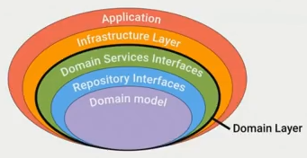
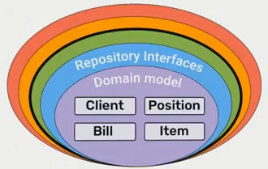

## DDD
[DDD Diagram](https://medium.com/spotlight-on-javascript/domain-driven-design-for-javascript-developers-9fc3f681931a)

**Create client**
```PHP
use Illuminate\Support\Str;

new Client(
    Str::uuid(),
    new Name('Firstname', 'Lastname'),
    new Address('Germany', 'Essen', '45141', 'Bismarkstr 12'),
    new Phone('+49', '234', '656577585')
);
```

**Create Item**
```PHP
use Illuminate\Support\Str;

$item = new Item(Str::uuid(), 'Silver bullet', Money::USD(1000));
$item->setDescription('This Bullet is nice!');
```

**Create**
```PHP
use Illuminate\Support\Str;

$client = new Client(
    Str::uuid(),
    new Name('Firstname', 'Lastname'),
    new Address('Germany', 'Essen', '45141', 'Bismarkstr 12'),
    new Phone('+49', '234', '656577585')
);

$item = new Item(Str::uuid(), 'Silver bullet', Money::USD(1000));
$quantity = 2;

$bill = new Bill(Str::uuid(), $client);
$bill->addPosition(new Position($item, $quantity));

// Add position to bill
$anotherPosition = new Position(
    new Item(Str::uuid(), 'Rage cup', Money::USD(500))
);
$bill->addPosition([$anotherPosition]);
$bill->changeStatus(new ProcessingStatus());
```

### Contexts
- /app/{contexts} // Subdomains

### Domain Layer

The Domain Layer knows nothing about the database or the framework.

**Struktur**

- **Domain Layer**
    - **Domain Model**
        - **Entity**<br>
          Has ID, Model with logic, Validation inside, can be non-anemic model
        - **Value Object**<br>
          Has no ID, Immutable object, Validation inside
        - **Aggregate**<br>
          Has ID, Consists of entities and value objects, One entity cannot be in another aggregate at the same time, This is the uniqueness boundary for the entity. You can not update the internals of the aggregate. Just re-create.,Other domain logic cannot refer to the internals of an aggregate, only to the aggregate itself. Entity can be aggregate.
    - **Repository Interfaces**<br>
        Only for aggregats, Aggregates are transactional (transactionCommit).
    - **Domain Services Interfaces**<br>
        Methods describing domain operations (not simple insert or update, beter changeStatus, ..., Service cann not save attributes with aggregates, A service can access other repositories and other services )
- **Infrastructure Layer**<br>
     Contains implementations of repositories and services
     Knows about the database
     Works with IoC (Inversion of Control) (Dependency Injection) Container
    - **Controllers**
    - **Data transfer objects**
    - **Services**
    - **Repositories**
- **Application Layer**
    - **App configs**
    - **Infrastruktur configs**
    - **Routes**

Domain Object



Domain Model



hydrator design pattern for Repository (map on object)
